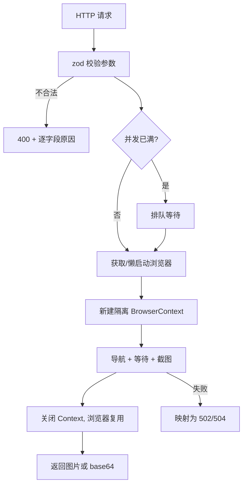

# screencut

基于 **Node.js + TypeScript + playwright-core** 的网页截图服务：传入一个 URL，拿回一张图片。

## 特性

- `GET /api/screenshot?url=...` 与 `POST /api/screenshot`（JSON body）两种调用方式，参数完全一致
- 默认直接返回图片二进制（`image/png` / `image/jpeg`），`response=json` 时返回 base64 与 data URI
- 支持整页、指定元素、指定区域（clip）截图，等待选择器、等待动画、暗色模式、自定义 UA/Cookie-less 请求头等
- 浏览器进程复用 + 每请求独立 `BrowserContext`（cookie/存储天然隔离），首请求懒启动，空闲后自动释放内存
- 并发上限 + 排队，避免打爆机器；优雅退出（`SIGTERM`/`SIGINT`）
- 可选的 API Key 鉴权、结构化 JSON 日志、`/health` 运行时状态

## 环境要求

- Node.js **>= 22.9**（用到 `--env-file-if-exists`，仓库内的 `engines` 已声明）
- 一个 Chromium 内核浏览器（三选一，见下文「浏览器准备」）

## 快速开始

```bash
npm install
cp .env.example .env      # 按需修改
npm run dev               # tsx watch，改代码自动重启
```

```bash
# 直接拿到 png 文件
curl -o shot.png "http://127.0.0.1:3000/api/screenshot?url=example.com&width=1200&height=800"

# 整页截图，元素加载完再截，返回 base64
curl -X POST http://127.0.0.1:3000/api/screenshot \
  -H 'content-type: application/json' \
  -d '{"url":"https://example.com","fullPage":true,"waitForSelector":"main","response":"json"}'
```

## 浏览器准备

`playwright-core` **不包含也不下载**浏览器，它会复用系统上已安装的 Chromium 内核浏览器。启动时会按下面的优先级选择：

1. `BROWSER_EXECUTABLE_PATH` —— 直接指定可执行文件（配置后不再尝试其他方式）
2. `BROWSER_CHANNEL` —— 使用已安装的品牌浏览器，如 `chrome`、`msedge`
3. 都不配置 —— 依次尝试 `chrome` → `msedge` → 内置 chromium

本机装了 Google Chrome 时开箱即用。若服务器上没有浏览器，执行：

```bash
npm run browser:install       # 等于 playwright install chromium
npm run browser:install -- --only-shell   # 只装 headless shell（无头服务够用，更小）
```

下载到共享缓存目录（macOS: `~/Library/Caches/ms-playwright`），`playwright-core` 能直接找到。

> `playwright-core` 自身不提供 `install` 命令，所以项目把 `playwright` 作为 devDependency 引入，
> 两者版本区间一致，会解析到同一个版本——这很重要：**浏览器 revision 必须和 `playwright-core` 对得上**，
> 否则启动时会报 `Executable doesn't exist ... please run playwright install`。
> 版本对不上时（比如升级了 playwright-core 却没重装浏览器），重跑一次上面的命令即可。

## 配置项

全部通过环境变量（或 `.env`）配置，`.env.example` 有完整注释。

| 变量 | 默认 | 说明 |
| --- | --- | --- |
| `HOST` / `PORT` | `0.0.0.0` / `3000` | 监听地址 |
| `LOG_LEVEL` | `info` | `debug` \| `info` \| `warn` \| `error` \| `silent` |
| `API_KEYS` | 空（不鉴权） | 逗号分隔；非空时 `/api/*` 必须带 Key |
| `MAX_CONCURRENCY` | `4` | 同时进行的截图上限，超出的请求排队 |
| `CAPTURE_TIMEOUT_MS` | `30000` | 请求未指定 `timeout` 时的默认超时 |
| `SHUTDOWN_TIMEOUT_MS` | `10000` | 优雅退出最长等待时间 |
| `BROWSER_EXECUTABLE_PATH` | 空 | 浏览器可执行文件路径 |
| `BROWSER_CHANNEL` | `chrome` | `chrome` / `chrome-beta` / `chrome-dev` / `chrome-canary` / `chromium` / `chromium-headless-shell` / `msedge` / `msedge-beta` / `msedge-dev` / `msedge-canary` |
| `BROWSER_HEADLESS` | `true` | 无头模式 |
| `BROWSER_NO_SANDBOX` | `false` | 置 `true` 会附加 `--no-sandbox --disable-dev-shm-usage`，root 容器里通常需要 |
| `BROWSER_ARGS` | 空 | 追加的 Chromium 启动参数（逗号分隔） |
| `BROWSER_LAUNCH_TIMEOUT_MS` | `30000` | 启动浏览器的超时 |
| `BROWSER_IDLE_TIMEOUT_MS` | `60000` | 空闲多久后关闭浏览器释放内存，`0` 表示常驻 |

配置不合法（例如 `BROWSER_CHANNEL` 写错、可执行文件不存在）时进程会直接启动失败并给出明确提示。

## API

### `GET|POST /api/screenshot`

POST 的 JSON body 优先级高于 query，可以把长参数放 body、用 query 快速调试。

| 参数 | 类型 | 默认 | 说明 |
| --- | --- | --- | --- |
| `url` | string | **必填** | http/https 地址；省略协议时按 `https://` 处理，最终会归一化 |
| `format` | `png` \| `jpeg` | `png` | 输出格式 |
| `quality` | 0-100 | — | 仅 `format=jpeg` 可用 |
| `width` / `height` | 1-10000 | `1280` / `800` | 视口尺寸（CSS 像素） |
| `deviceScaleFactor` | 0.1-4 | `1` | 设为 `2` 可得到 2 倍高清图 |
| `fullPage` | boolean | `false` | 截整页而非仅视口 |
| `selector` | string | — | 只截取第一个匹配元素 |
| `clip` | `"x,y,width,height"` 或对象 | — | 截取页面指定区域 |
| `waitUntil` | `load` \| `domcontentloaded` \| `networkidle` \| `commit` | `load` | 导航完成的判定条件 |
| `timeout` | 1000-300000 | `CAPTURE_TIMEOUT_MS` | 导航与等待的超时（毫秒） |
| `waitForSelector` | string | — | 额外等待该元素可见 |
| `waitForTimeout` | 0-60000 | — | 加载完成后再等待的毫秒数（等动画/懒加载） |
| `userAgent` | string | — | 覆盖 UA |
| `headers` | object | — | 附加请求头（仅 POST body） |
| `darkMode` | `light` \| `dark` \| `no-preference` | `no-preference` | 偏好配色 |
| `ignoreHTTPSErrors` | boolean | `false` | 忽略证书错误（自建环境常用） |
| `omitBackground` | boolean | `false` | 透明背景，仅 `png` |
| `response` | `image` \| `json` | `image` | 返回图片二进制或 base64 |

- boolean 参数接受 `true/false/1/0/yes/no`，query 里直接写字符串即可
- `quality` 仅限 jpeg；`fullPage` 与 `selector`/`clip` 互斥；`selector` 与 `clip` 互斥 —— 冲突会返回 400 并指出字段

**成功响应**

- `response=image`：`Content-Type: image/png|image/jpeg`，响应体为图片，附带 `X-Screenshot-Duration-Ms`、`Cache-Control: no-store`
- `response=json`：

```json
{
  "url": "https://example.com/",
  "format": "png",
  "contentType": "image/png",
  "bytes": 18062,
  "durationMs": 1451,
  "viewport": { "width": 1280, "height": 800, "deviceScaleFactor": 1 },
  "fullPage": true,
  "selector": null,
  "data": "iVBORw0KGgo...",
  "dataUri": "data:image/png;base64,iVBORw0KGgo..."
}
```

**失败响应**（所有错误统一格式）

```json
{
  "error": {
    "code": "invalid_request",
    "message": "截图参数不合法",
    "details": [{ "path": "url", "message": "url 必须是合法的 http/https 地址" }]
  }
}
```

| HTTP | code | 含义 |
| --- | --- | --- |
| 400 | `invalid_request` / `bad_request` | 参数不合法（`details` 里是逐字段原因）/ 请求体不是合法 JSON |
| 401 | `unauthorized` | 缺少或错误的 API Key |
| 404 | `not_found` | 路由不存在 |
| 502 | `dns_error` / `connection_error` / `capture_failed` | 域名解析失败 / 连不上目标 / 其他渲染失败 |
| 503 | `browser_unavailable` | 启动不了浏览器（未安装或配置有误，`message` 里有尝试过的策略） |
| 504 | `capture_timeout` | 导航或等待元素超时 |

### `GET /health`

公开、无需鉴权，用于探活。

```json
{
  "status": "ok",
  "uptimeSeconds": 42,
  "details": {
    "browser": { "connected": true, "strategy": "channel:chrome", "activeContexts": 1 },
    "capture": { "active": 1, "queued": 3 }
  }
}
```

## 请求流程



## 项目结构

```
Dockerfile               # 多阶段构建：编译 → 生产依赖 → 运行镜像
.env.example             # 所有环境变量及说明
src/
├── index.ts               # 进程入口：装配依赖、监听、优雅退出
├── app.ts                 # Express app 组装（可单测，不监听端口）
├── config.ts              # 环境变量解析与校验
├── logger.ts              # 结构化 JSON 日志
├── errors.ts              # HttpError
├── middleware.ts          # 请求日志、API Key 鉴权、404、错误处理
├── semaphore.ts           # 并发信号量
├── browser/manager.ts     # 浏览器生命周期：懒启动、复用、空闲回收
└── screenshot/
    ├── schema.ts          # 请求参数 zod schema 与类型
    ├── service.ts         # 截图编排与 Playwright 错误映射
    └── router.ts          # /api/screenshot 路由
test/                      # vitest：参数校验、配置、路由（假 service）、真实浏览器集成
```

## 脚本

| 命令 | 说明 |
| --- | --- |
| `npm run dev` | `tsx watch` 开发模式 |
| `npm run build` | `tsc` 编译到 `dist/` |
| `npm start` | 运行编译产物 |
| `npm run typecheck` | 类型检查（含 `test/`，不产出文件） |
| `npm test` | 运行全部测试 |
| `npm run browser:install` | 用本地 playwright CLI 下载 chromium（版本与 playwright-core 自动对齐）；`npm run browser:install -- --only-shell` 可只下 headless shell |

## Docker

```bash
docker build -t screencut .
docker run --rm -p 3000:3000 screencut
curl -o shot.png "http://127.0.0.1:3000/api/screenshot?url=example.com&fullPage=true"
```

最终镜像约 **655MB**（其中 chromium headless shell 解压后 ~266MB、基础镜像 ~90MB），做法是：

- **多阶段构建**：最终镜像只包含编译产物 + 生产依赖，devDependencies、源码、npm 缓存都不进去
- **只装 chromium 的 headless shell**（`playwright install --only-shell chromium`），本服务只跑无头模式，不需要完整 chromium
- **系统库沿用 playwright 官方的 debian12 依赖表，但去掉 `xvfb`**：它只给「有头模式」提供虚拟显示，却会连带拉进 Mesa/LLVM 约 200MB 图形栈（实测这一条就省了 208MB）
- 预置中文（wqy-zenhei）/日文/emoji 字体，否则中文页面会渲染成方块
- 浏览器版本号从已安装的 `playwright-core` 推导，避免 npx 拉到更新的 playwright 导致 revision 对不上

镜像内的默认环境变量（`docker run -e` 可覆盖）：`BROWSER_CHANNEL=chromium-headless-shell`、`BROWSER_NO_SANDBOX=true`、`PLAYWRIGHT_BROWSERS_PATH=/ms-playwright`、`PORT=3000`、`MAX_CONCURRENCY=4`、`CAPTURE_TIMEOUT_MS=30000`。

Docker Hub 拉不动时走镜像源：

```bash
docker build --build-arg NODE_IMAGE=docker.m.daocloud.io/library/node:22-slim -t screencut .
```

容器相关注意事项：

- 容器里以 root 运行，而 Chromium 不允许 root 直接用沙箱，所以默认 `BROWSER_NO_SANDBOX=true`（会附带 `--no-sandbox --disable-dev-shm-usage`）。想用非 root：把 `CMD` 前面加上 `USER node` 并把 `BROWSER_NO_SANDBOX` 设为 `false`。
- 默认 `--disable-dev-shm-usage` 是为了绕开容器内 64MB 的 `/dev/shm`；如果你更想用共享内存，可以改 `--shm-size=1g` 并去掉该参数。
- 探活用镜像内置的 `HEALTHCHECK`（用 node 的 `fetch` 请求 `/health`，不额外装 curl），`docker ps` 里直接能看到 `healthy`。
- 收到 `SIGTERM` 会优雅退出（`docker stop` 生效），实测 20ms 内退出。

镜像内实测过的点：HTTPS 站点截图、整页/元素截图、中文+日文+emoji 渲染、WebGL（SwiftShader，不依赖 Mesa）、健康检查与优雅退出。

## 测试

`npm test` 共 53 个用例，分四层：

- `test/schema.test.ts` —— 参数校验、默认值、query string 形态、非法组合
- `test/config.test.ts` —— 环境变量默认值、非法配置报错、channel 白名单、容器用的那套变量
- `test/app.test.ts` —— 用 supertest + 假 service 覆盖路由、状态码、鉴权、错误映射（不需要浏览器）
- `test/screenshot.integration.test.ts` —— 起一个本地 HTTP 夹具页面，用**真实浏览器**验证 png/jpeg、整页、元素截图、等待选择器；本机没有可用浏览器时会自动跳过而不是失败

## 上线前请注意

- **SSRF**：这个服务会访问调用方指定的任意 URL，包括内网地址和云元数据端点（`169.254.169.254`）。公网部署前务必加上 URL 白名单/黑名单或用网络策略隔离出站流量；`API_KEYS` 只解决「谁能调用」，不解决「能访问哪里」。
- **鉴权**：`API_KEYS` 为空时接口完全开放，只适合内网或本机。
- **容器**：以 root 运行时设置 `BROWSER_NO_SANDBOX=true`；建议配合 `MAX_CONCURRENCY` 和内存限制，浏览器是内存大户。
- **反向代理**：整页大图可能较慢，记得把 Nginx/网关的 `proxy_read_timeout` 调到大于 `CAPTURE_TIMEOUT_MS`。
